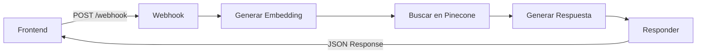

# 🤖 N8N Workflow - Agent POL RAG Chat

Este archivo contiene el workflow completo de n8n para el sistema de chat RAG. 

## 📋 Descripción del Workflow

El workflow implementa un agente de chat inteligente que puede responder preguntas sobre documentos PDF procesados usando la siguiente arquitectura:

```
🎯 Webhook → 🧠 Embedding → 🔍 Pinecone → 🤖 GPT → 📤 Respuesta
```

## 🔧 Nodos del Workflow

### 1. 🎯 Webhook - Entrada del Chat
- **Tipo**: `n8n-nodes-base.webhook`
- **Función**: Recibe las preguntas del frontend
- **Entrada esperada**: 
  ```json
  {
    "pregunta": "¿Qué dice el documento sobre...?"
  }
  ```
- **Path**: `rag-chat-agent`

### 2. 🧠 Generar Embedding
- **Tipo**: `n8n-nodes-base.code`
- **Función**: Convierte la pregunta en embedding usando OpenAI
- **API utilizada**: OpenAI Embeddings API
- **Modelo**: `text-embedding-3-small`
- **Variables requeridas**: `OPENAI_API_KEY`

### 3. 🔍 Búsqueda en Pinecone
- **Tipo**: `n8n-nodes-base.code`
- **Función**: Busca contexto relevante en la base de datos vectorial
- **API utilizada**: Pinecone Query API
- **Parámetros**: topK=5, score mínimo=0.7
- **Variables requeridas**: 
  - `PINECONE_API_KEY`
  - `PINECONE_ENVIRONMENT`
  - `PINECONE_INDEX_NAME`

### 4. 🤖 Generar Respuesta GPT
- **Tipo**: `n8n-nodes-base.code`
- **Función**: Genera respuesta contextual usando GPT
- **API utilizada**: OpenAI Chat Completions API
- **Modelo**: `gpt-4o-mini`
- **Parámetros**: max_tokens=500, temperature=0.7

### 5. 📤 Responder al Chat
- **Tipo**: `n8n-nodes-base.respondToWebhook`
- **Función**: Devuelve la respuesta al frontend
- **Formato**: JSON con headers CORS
- **Respuesta**: 
  ```json
  {
    "respuesta": "Respuesta generada...",
    "metadata": {
      "pregunta": "Pregunta original",
      "tieneContexto": true,
      "numeroResultados": 3,
      "timestamp": "2025-10-07T10:30:00.000Z",
      "modelo": "gpt-4o-mini"
    }
  }
  ```

## ⚙️ Variables de Entorno Requeridas

Configura estas variables en tu instancia de n8n:

```env
# OpenAI API
OPENAI_API_KEY=sk-...

# Pinecone Configuration
PINECONE_API_KEY=...
PINECONE_ENVIRONMENT=us-east-1
PINECONE_INDEX_NAME=nombre-de-tu-indice
```

## 🚀 Cómo Importar el Workflow

1. **Copia el contenido** de `plantilla_n8n.json`
2. **Abre n8n** en tu navegador
3. **Crea un nuevo workflow**
4. **Haz clic en el menú** (3 puntos) → **Import from JSON**
5. **Pega el JSON** y confirma la importación
6. **Configura las variables de entorno** en Settings → Environment variables
7. **Activa el workflow**

## 🔗 URL del Webhook

Una vez importado y activado, tu webhook está configurado en:

```
https://jdejose.app.n8n.cloud/webhook/rag-chat-agent
```

Esta URL ya está configurada en el frontend (`app.js`):

```javascript
const WEBHOOK_URL = 'https://jdejose.app.n8n.cloud/webhook/rag-chat-agent';
```

## 🧪 Pruebas del Workflow

### Prueba Manual en n8n
1. **Activa el workflow**
2. **Ve al nodo Webhook** y haz clic en "Listen for calls"
3. **Usa Postman o curl** para enviar una petición POST:

```bash
curl -X POST https://jdejose.app.n8n.cloud/webhook/rag-chat-agent \
  -H "Content-Type: application/json" \
  -d '{"pregunta": "¿Qué dice el documento sobre inteligencia artificial?"}'
```

### Respuesta Esperada
```json
{
  "respuesta": "Según el documento procesado, la inteligencia artificial...",
  "metadata": {
    "pregunta": "¿Qué dice el documento sobre inteligencia artificial?",
    "tieneContexto": true,
    "numeroResultados": 3,
    "timestamp": "2025-10-07T10:30:00.000Z",
    "modelo": "gpt-4o-mini"
  }
}
```

## 🛠️ Personalización

### Ajustar Sensibilidad de Búsqueda
En el nodo "🔍 Búsqueda en Pinecone", modifica:
```javascript
.filter(match => match.score > 0.7) // Cambiar 0.7 por el umbral deseado
```

### Cambiar Modelo de GPT
En el nodo "🤖 Generar Respuesta GPT", modifica:
```javascript
model: 'gpt-4o-mini', // Cambiar por 'gpt-4', 'gpt-3.5-turbo', etc.
```

### Ajustar Longitud de Respuesta
```javascript
max_tokens: 500, // Aumentar para respuestas más largas
```

## 🚨 Solución de Problemas

### Error: Variables de entorno no configuradas
- Verifica que todas las variables estén configuradas en n8n
- Reinicia el workflow después de configurar las variables

### Error: Pinecone API
- Verifica que el índice existe en Pinecone
- Confirma que el environment es correcto (us-east-1, etc.)

### Error: OpenAI API
- Verifica que tienes créditos en tu cuenta de OpenAI
- Confirma que la API key es válida

### Sin contexto relevante
- Verifica que los PDFs fueron procesados correctamente
- Ajusta el umbral de similitud (score > 0.7)
- Revisa que el índice de Pinecone tiene datos

## 📊 Monitoreo y Logs

El workflow incluye logging detallado en la consola de n8n:

- ✅ Confirmaciones de éxito
- ⚠️ Advertencias sobre contexto
- ❌ Errores con detalles específicos
- 📊 Estadísticas de búsqueda y respuesta

## 🔄 Flujo de Datos



---

**Nota**: Este workflow está optimizado para ser eficiente y económico, usando `gpt-4o-mini` y `text-embedding-3-small` que son los modelos más cost-effective de OpenAI.